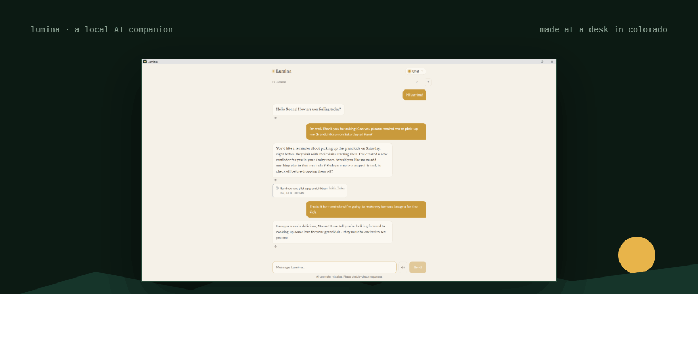

# Lumina

**A little AI who lives on your computer.** She chats, speaks, listens,
remembers what matters to you, keeps your notes, tracks your reminders, and
writes you a morning brief — and every bit of it runs on your own Windows
machine. Not "private mode." Not "we promise not to look." Physically local:
unplug your internet and she keeps working.

She was built with a specific person in mind: somebody's nonna — the kind of
person who deserves an AI that's warm and simple, and whose words stay home.



---

## The deal

- **The source lives here** — read it, learn from it, build it for yourself.
  This is v1.0 as it shipped.
- **The installer lives on [Gumroad](https://baerdev.gumroad.com/l/lumina)**
  — $15, once. That's what the money buys: the assembled app, updates through
  v1.x, and a developer who answers his own email.
- **This is source-available, not open source.** Details in
  [LICENSE.md](LICENSE.md).

If you'd rather spend an afternoon compiling than fifteen dollars, that's a
real choice and it's yours — everything you need is in this repo.

## What's inside

| Piece | What it does |
|---|---|
| **React + Vite** | The four rooms (Chat, Today, Memory, Library) + Tune and Settings |
| **FastAPI + uvicorn** | The local backend, port 8000 |
| **Ollama** | Runs her brain — llama3.2:3b by default, 8b and 14b on the shelf |
| **nomic-embed-text** | Her memory's filing system (meaning → coordinates) |
| **LanceDB** | Where memories live, as vectors, on your disk |
| **Kokoro** | Her voice — six of them, all local |
| **faster-whisper** | Her ears |
| **PyInstaller + Inno Setup** | Freezes and installs her, per-user, no admin |

Everything above runs on the machine in front of you. The only outbound
requests she can make are the ones you switch on by name — weather, news, a
Wikipedia lookup, an update check — and the Settings page shows you exactly
what's on.

## The principles (or: why the code looks like this)

**Facts are computed in code; the model only provides voice.** Small local
models are warm and useful and *terrible clerks*. So dates, reminder buckets,
weather, and headlines are assembled by code, and the model is handed the
finished truth to narrate. It never does arithmetic it can get wrong.

**A missing section is stated out loud.** Silence in her data invites a small
model to pattern-complete what's usually there — that's how a brief once
invented four confidently-sourced news stories that never happened. Now the
data says `News: NONE today`, and code scans the finished brief for the
vocabulary of absent sections. Caught twice → a plainer brief, written
entirely by code, ships instead. Truth outranks style.

**Every claim keeps its receipt.** The brief's grounding pills render from the
ingredients, not from her prose.

**If a state matters, every road there must build all of it.** An interrupted
download once produced users whose AI could think but couldn't remember — the
memory embedder arrived through exactly one path, and that path had a hole.
It now has four doors: the download chain, the end of setup, every startup,
and the moment of need.

**Silent failure is the price of graceful failure — so the quiet parts
squeak.** Optional self-repairs are wrapped so they can't crash the app, and
every one of them logs when it skips. A safety net you never test is just a
place errors go to hide.

**The glass box.** Her data is plain readable files in one ordinary folder
(`YourAI`). Uninstalling never touches them, and the uninstaller says so.

## Run it in dev

You'll need Python 3.11+, Node 18+, and [Ollama](https://ollama.com)
installed. Ollama can be empty — her setup wizard walks you through fetching
a brain the first time she runs.

```bash
# backend
cd backend
python -m venv venv
source venv/Scripts/activate        # git bash on Windows
pip install -r requirements.txt
pip uninstall espeakng-loader phonemizer-fork -y   # GPL eviction, see below
python -m spacy download en_core_web_sm            # her voice's tokenizer
uvicorn app:app --reload

# frontend, in a second terminal
cd frontend
npm install
npm run dev
```

Then open **http://localhost:5173** — Vite serves the UI and proxies the API
to uvicorn on 8000.

**The GPL eviction is not optional.** Kokoro pulls in an espeak fallback, and
espeak-ng is GPL-3.0. Lumina ships with zero GPL: unknown words are skipped
and taught through the pronunciations lexicon instead. `pip check` will
grumble that misaki wants the pair back — that grumble is the receipt of a
deliberate choice. (The PyInstaller spec excludes them too, so a forgotten
eviction can't leak into a build.)

## Build the installer

The real sequence, in order — the frontend must be built first, because the
frozen backend serves the built files:

```bash
taskkill //F //IM Lumina.exe        # git bash: kill a running copy first,
                                    # or the freeze fights it for the port

cd frontend
npm run build                       # → frontend/dist/, which the spec bundles

cd ../backend
source venv/Scripts/activate
pip install -r requirements-dev.txt
pyinstaller lumina.spec --noconfirm # → backend/dist/Lumina/

cd dist/Lumina
./Lumina.exe                        # smoke test BEFORE packaging:
                                    # first log line should name the version
```

Then compile `lumina.iss` (repo root) with
[Inno Setup](https://jrsoftware.org/isinfo.php) — F9 in the IDE. Output is a
per-user installer in `Output\` that needs no admin rights.

Honest warning: the freeze is ~1.4 GB (torch, mostly) and the whole chain
takes an afternoon the first time. The $15 exists because of that afternoon.

## Installing the built app

See [INSTALL.md](INSTALL.md) — including the click-path through the two
scary-looking warnings Windows shows for software from independent
developers. They're about popularity, not safety, and they're explained
honestly there.

## License

[PolyForm Noncommercial 1.0.0](LICENSE.md). Read it, learn from it, modify
it, build it for yourself, share your changes with other people who aren't
selling it. Commercial use needs a conversation — my email's below.

This is **source-available, not open source** — the OSI definition requires
allowing commercial use, and this license doesn't. The distinction matters
and I'm not going to blur it.

## Say hello

**hello@baer-dev.com** — I built her at a desk in Colorado and I answer my
own mail.
